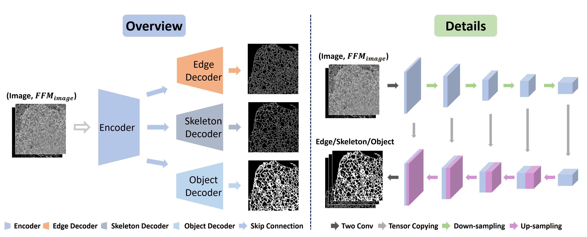

# FFM-Multi-Decoder-Network
The official code repository for the ECCV 2024 accepted paper "Representing Topological Self-Similarity Using Fractal Feature Maps for Accurate Segmentation of Tubular Structures".

# Representing Topological Self-Similarity Using Fractal Feature Maps for Accurate Segmentation of Tubular Structures

## Overview
Workflow of computing FFM of an image.

Overview and details of our proposed model multi-decoder network (MD-Net).



## Preparing Dataset
### Files of training and testing 
Please generate ".txt" files for train data and test data separately. In the ".txt" file, each line consists of the path of image and mask corresponding to the image.

For example:

```
/datasets/directory/train_mito.txt
	└── .../MITO/train/images/20_h384_w384.tif .../MITO/train/masks/20_h384_w384.tif
/datasets/directory/test_mito.txt
	└── .../MITO/test/images/20_h384_w384.tif .../MITO/test/masks/20_h384_w384.tif
```

### Computation of FFMs 

Please utilize the functions in [fractak_analysis.py](./fractal_analysis.py) to compute FFMs of images.

The first function compute_FFM is used to compute a Fractal Feature Map for an image.
```
Input:
    image: A 2D array containing a grayscale image;;
    window_size: the size of sliding window;
    step_size: the size of sliding step;
Output:
    FFM: the fractal feature map of image.
    
def compute_FFM(image, step_size, window_size):
```
The second function compute_FMM_Pool is used to compute and save Fractal Feature Maps for a list of images.
```
Input:
    file_path: the root path of images;
    window_size: the size of sliding window;
    step_size: the size of sliding step;
    
def compute_FMM_Pool(file_path, window_size, step_size):
```

### Extraction of edge and skeleton

To extract the edges and skeletons of segmentation objects, please utilize the functions in [get_edge_skeleton.py](./get_edge_skeleton.py).
```
def edge_extract(root):

def skeleton_extract(root):
```
Provide the file path of labels to these functions, you will get the edges and skeletons of labels.
## Setup

Setting up for this project.

### Installing dependencies

To install all the dependencies, please run the following:

```
pip install -r requirements.txt or conda install --yes --file requirements.txt
```

## Running

### Training

In this project, we used models U-Net, HR-Net and MD-Net in the experimental phase. To facilitate the training of the different models, we created five different training files.

Below lines will run the training code with default setting in the file. The value of warmup_step can be adjusted according to the size of the dataset.

```
python train_unet.py
python train_hrnet.py
python train_mdnet.py
python train_mdnet_weighted.py
python train_tdet.py
python train_tdnet_weighted.py
```

Before training, you need to assign the file path of FFMs, edges and skeletons in the dataset files. 

For example, in [ER_dataset.py](./datasets/ER_dataset.py):
```
# the path of FFM_image
npy_path = img_path.replace("images", self.fractal_dir)
# the path of FFM_label
weight_path = mask_path.replace('masks', 'masks' + self.weight_dir)

edge_path = mask_path.replace('masks', self.edge_dir)
skeleton_path = mask_path.replace('masks', 'self.skeleton_dir)
```
### Inference and Evaluation

In order to obtain segmentation results and evaluate model's performance under different thresholds, you can run the following lines: 

```
Set up
 model_choice = ['unet', 'hrnet', 'Two_decoder_Net', 'Multi_decoder_Net']
 dataset_list = ['er', 'er_fractal', 'er_fractal_two_decoder', 'nucleus_fractal_two_decoder','nucleus_fractal_two_decoder_weighted']
 txt_choice = ['test_mito.txt', 'test_er.txt', 'test_stare.txt']
Run 
 python inference.py
 python evaluation.py
```
